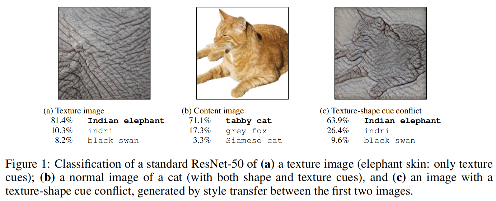

# Data, code and materials from <br>"ImageNet-trained CNNs are biased towards texture; increasing shape bias improves accuracy and robustness"

This repository contains information, data and materials from the paper [ImageNet-trained CNNs are biased towards texture; increasing shape bias improves accuracy and robustness](https://openreview.net/forum?id=Bygh9j09KX) by Robert Geirhos, Patricia Rubisch, Claudio Michaelis, Matthias Bethge, Felix A. Wichmann, and Wieland Brendel. We hope that you may find this repository a useful resource for your own research.

The core idea is explained in the Figure below: If a Convolutional Neural Network sees a cat with elephant texture, it thinks it's an elephant even though the shape is still clearly a cat. We found this "texture bias" to be common for ImageNet-trained CNNs, which is in contrast to the widely held belief that CNNs mostly learn to recognise objects by detecting their shapes.
 

Please don't hesitate to contact me at robert.geirhos@bethgelab.org or open an issue in case there is any question! Reproducibility & Open Science are important to me, and I appreciate feedback on what could be improved.

This README is structured according to the repo's structure: one section per subdirectory (alphabetically).

##### Related repositories:
Note that Stylized-ImageNet, an important dataset used in this paper, has its own repository at [rgeirhos:Stylized-ImageNet](https://github.com/rgeirhos/Stylized-ImageNet).

Some aspects of this repository are borrowed from our earlier work, "Generalisation in humans and deep neural networks" (published at NeurIPS 2018). The corresponding code, data and materials can be obtained from [rgeirhos:generalisation-humans-DNNs](https://github.com/rgeirhos/generalisation-humans-DNNs). For convencience, some human data from this repo (which are used in the texture-vs-shape work for comparison) are included here directly (under ``raw-data/raw-data-from-generalisation-paper/``).


## data-analysis
The ``data-analysis/`` directory contains the main analysis script ``data-analysis.R`` and some helper functionality. All created plots will then be stored in the ``paper-figures/`` directory.


## lab-experiment
Everything necessary to run an experiment in the lab with human participants. This is based on MATLAB.

##### experimental-code
Contains the main MATLAB experiment, `shape_texture_experiment.m`, as well as a `.yaml` file where the specific parameter values used in an experiment are specified (such as the stimulus presentation duration). Some functions depend on our in-house iShow library which can be obtained from [here](http://dx.doi.org/10.5281/zenodo.34217).

##### helper-functions
Some of the helper functions are based on other people's code, please check out the corresponding files for the copyright notices.


## models
The file ``load_pretrained_models.py`` will load the following models that are trained on Stylized-ImageNet:

```python
    model_A = "resnet50_trained_on_SIN"
    model_B = "resnet50_trained_on_SIN_and_IN"
    model_C = "resnet50_trained_on_SIN_and_IN_then_finetuned_on_IN"
```
These correspond to the models reported in Table 2 of the paper (method details in Section A.5 of the Appendix).

We used the [PyTorch ImageNet training script](https://github.com/pytorch/examples/tree/master/imagenet)  to train the models. These are the training hyperparameters:

- batch size: 256
- optimizer: SGD (`torch.optim.SGD`)
- momentum: 0.9
- weight decay: 1e-4
- number of epochs: 60 (`model_A`) respectively 45 (`model_B`). However, these 45 epochs for `model_B` correspond to 90 epochs of normal ImageNet training since the dataset used to train `model_B` is twice as large (combined ImageNet and Stylized-ImageNet), thus in every epoch the classifier sees twice as many images as in a standard epoch.
- learning rate: 0.1 multiplied by 0.1 after every 20 epochs (`model_A`) respectively after every 15 epochs (`model_B`).
- pretrained on ImageNet: True (for `model_A` and for `model_B`), i.e. using `torchvision.models.resnet50(pretrained=True)`. Initialising models weights with the standard weights from ImageNet training proved beneficial for overall accuracy.

`model_C` was initialised with the weights of `model_B`. Fine-tuning on ImageNet was then performed for 60 epochs using a learning rate of 0.01 multiplied by 0.1 after 30 epochs. The other hyperparameters (batch size, optimizer, momentum & weight decay) were identical to the ones used for training `model_A` and `model_B`.

For dataset preprocessing, we used the standard ImageNet normalization for both IN and SIN (as e.g. used in the [PyTorch ImageNet training script](https://github.com/pytorch/examples/tree/master/imagenet)), with the following mean and standard deviation:

- mean = [0.485, 0.456, 0.406]
- std = [0.229, 0.224, 0.225]


## paper-figures
Contains all figures of the paper. All figures reporting results can be generated by the scripts in `data-analysis/`.


## raw-data
Here, a ``.csv`` file for each observer and network experiment contains the raw data, including a total number of 48,560 human psychophysical trials across 97 participants in a controlled lab setting.


## stimuli
These are the raw stimuli used in our experiments. Each directory contains stimuli images split into 16 subdirectories (one per category).


